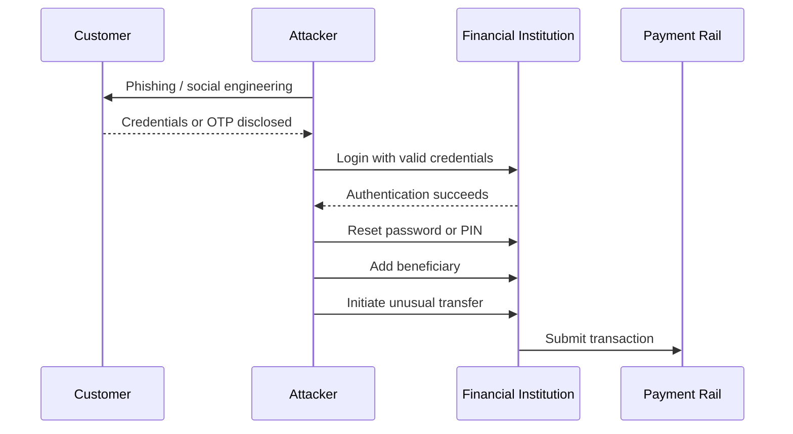
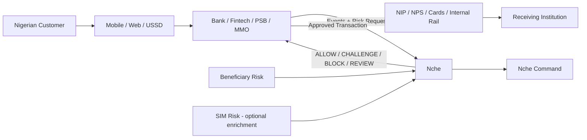
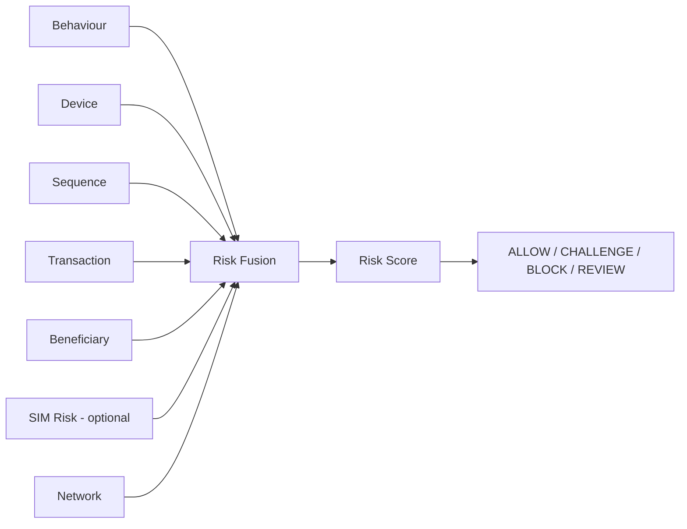
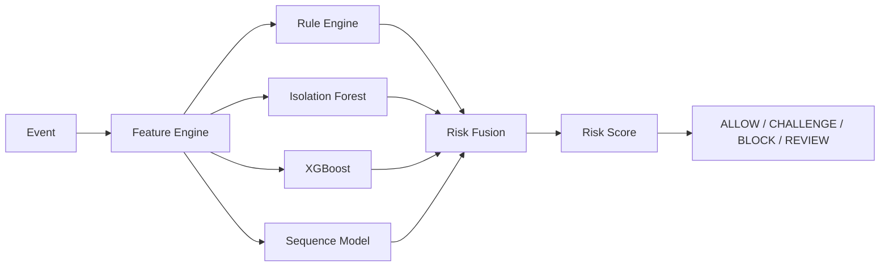

# Nche

> **A measured, explainable, cross-channel account-takeover risk engine for Nigerian financial institutions that don't have the resources to build equivalent fraud infrastructure internally.**

**Repository:** https://github.com/thetruesammyjay/nche

## Local development

Start the FastAPI service from the API workspace with the `nche` package entrypoint:

```powershell
cd apps/api
uv sync
uv run uvicorn nche.main:app --reload
```

The import target is `nche.main:app`; there is no `app.main` package in this repository. The API uses an in-memory repository when `DATABASE_URL` is not set. See [apps/api/README.md](apps/api/README.md) for database and deployment configuration.

---

```text
THE PASSWORD IS CORRECT.
THE OTP IS CORRECT.
THE LOGIN SUCCEEDS.

But it isn't the customer.
```

```text
03:12  Login                    Risk 21
03:13  New device               Risk 42
03:14  Password reset           Risk 57
03:14  New beneficiary          Risk 74
03:15  ₦650,000 transfer        Risk 90

                    BLOCK
```

**This is Nche.**

---

## What Nche Is

Nche is an API-first fraud-intelligence platform for Nigerian banks, fintechs, Payment Service Banks (PSBs), Mobile Money Operators (MMOs), microfinance banks, wallets, lenders, and cooperatives.

Nche does not replace authentication, core banking, NIBSS, NIP, NPS, or a payment gateway. It sits beside the institution's transaction flow and evaluates behavioural, device, session, transaction, and beneficiary signals before a sensitive action completes, returning one of four explainable recommendations:

**ALLOW · CHALLENGE · BLOCK · REVIEW**

> **Valid credentials prove that someone knows the secret. They do not always prove that the person controlling the account is the legitimate owner.**

Nche is decision-support infrastructure, not a decision-maker. The integrating institution retains final authority over its own risk policy.

## Implemented Product Surface

The current implementation is a working vertical slice from event sequence to analyst-facing decision:

- **Risk engine:** deterministic risk fusion combines event timing, device novelty, credential changes, beneficiary novelty, and transaction amount relative to the customer's median.
- **FastAPI service:** `POST /risk/evaluate` remains available for standard evaluations. `POST /v1/evaluate_action` evaluates a sensitive action immediately before submission and persists the resulting evidence.
- **Observe and Enforce modes:** `X-Nche-Mode: Observe` returns shadow decisions without asserting enforcement; `X-Nche-Mode: Enforce` marks the evaluation as institution-enforced while the institution still owns the final authorization decision.
- **Safe retries:** `Idempotency-Key` is stored with the evaluation. Retrying the same action returns the original evaluation with `idempotent_replay: true` instead of creating a second decision.
- **Latency contract:** action evaluations return `latency_ms` and expose `X-Nche-Latency-Ms`. The in-memory path is designed to stay inside the 50 ms pre-transfer budget.
- **Persistence:** PostgreSQL stores evaluation evidence and idempotency keys through the `0002_add_idempotency_key` migration; local development falls back to the in-memory repository when `DATABASE_URL` is not configured.
- **Nche Command:** the dashboard exposes investigation timelines, machine evidence, risk distributions, model provenance, and live API metadata.
- **Demo Financial App:** the transfer flow calls the action endpoint through a same-origin Next.js route, shows a pending state, renders the returned score/evidence/mode/latency, and fails open to local institution rules when Nche is unavailable.

The web BFF endpoint is `POST /api/risk/evaluate-action`. It forwards the request to the FastAPI action endpoint with a 50 ms timeout and returns a `504` upstream response when the frontend must use its local fail-open path.

Example action response:

```json
{
  "evaluation_id": "eval_4b19",
  "decision": "BLOCK",
  "risk_score": 90,
  "risk_level": "critical",
  "recommended_action": "block",
  "policy_rule": "ATO_CRITICAL_001",
  "primary_reason": "account_takeover_sequence",
  "mode": "Enforce",
  "enforced": true,
  "idempotent_replay": false,
  "latency_ms": 2.41,
  "fallback": false,
  "evidence": [
    { "event": "new_device_login", "seconds_after_previous": 0 },
    { "event": "password_reset", "seconds_after_previous": 53 },
    { "event": "beneficiary_created", "seconds_after_previous": 18 },
    { "event": "transfer_initiated", "amount_vs_customer_median": 18.4 }
  ],
  "model_version": "nche-risk-v0.2.0"
}
```

The frontend stores the latest action response for the linked investigation view so analysts can inspect the same decision that was shown during the transfer flow. If the action endpoint times out, the UI clearly labels the result as a local-rules fallback and does not present it as an Nche block.

---

## Why Nche Exists

Nigeria's largest platforms — OPay, Moniepoint, the major banks — already run sophisticated internal fraud engineering teams: device intelligence, behavioural models, real-time scoring, proprietary risk systems.

Most Nigerian financial institutions cannot build that. Nche turns those capabilities into reusable, API-delivered infrastructure:

> **How can smaller and emerging Nigerian financial institutions access explainable, real-time account-takeover intelligence without building an OPay-scale fraud engineering team from scratch?**

---

## The Nigerian Problem, Grounded in Current Data

According to NIBSS's 2025 reporting (presented at the 2026 Nigeria Electronic Fraud Forum), digital payment fraud losses fell 51% year-over-year to ₦25.85 billion, driven by regulatory coordination and improved identity management (BVN/NIN integration). Despite that improvement, NIBSS's Managing Director identified **social engineering — particularly insider abuse — as the most prevalent fraud technique**, with SIM-swap fraud, account compromise, and phishing named as fast-evolving secondary threats. E-commerce and internet banking remain the most-affected channels.

Nche is scoped deliberately: it addresses **customer-facing account takeover following credential or OTP compromise** — the sequence of events *after* a fraudster has valid-looking access — not internal staff-access controls, which is a separate problem requiring separate tooling.



```text
Authentication succeeded
≠
Account owner is definitely in control
```

---

## Where Nche Fits



Nche stays outside the money-moving rail at all times.

---

## Architecture



**SIM risk is an enrichment signal, not a dependency.** Nche functions fully with `SIM Risk = UNKNOWN`. Where SIM-swap intelligence is available (e.g. via NIBSS's Industry SIM Swap Service), it improves confidence — it is never required for a decision. The UI marks its provenance explicitly:

```text
SIM Intelligence
Source: SIMULATED   (hackathon MVP)
Source: NIBSS SIM SWAP SERVICE   (production)
```

### Behavioural sequence intelligence

Nche evaluates the *relationship and timing* between events, not events in isolation.

```text
New Device Login
    ↓ 42 seconds
Password Reset
    ↓ 18 seconds
New Beneficiary
    ↓ 24 seconds
₦850,000 Transfer
```

### Beneficiary and mule-risk intelligence

Nche asks both:
- Is the sender behaving unusually?
- Is the destination account itself risky? (first-time recipient, beneficiary age, rapid incoming-to-outgoing movement, prior fraud associations, payout velocity)

---

## Machine-Learning Strategy



An LLM, where used, rephrases the deterministic explanation for readability. It does not participate in the risk decision itself. Every decision is reconstructible from the evidence object below without the LLM in the loop.

---

## Explainability

Nche returns two paired explanations for every non-ALLOW decision.

**Machine explanation (audit trail):**

```json
{
  "decision": "BLOCK",
  "risk_score": 90,
  "risk_level": "critical",
  "recommended_action": "block",
  "policy_rule": "ATO_CRITICAL_001",
  "primary_reason": "account_takeover_sequence",
  "evidence": [
    { "event": "new_device_login", "weight": 0.17 },
    { "event": "password_reset", "seconds_after_previous": 43 },
    { "event": "beneficiary_created", "seconds_after_previous": 21 },
    { "event": "high_value_transfer", "amount_vs_customer_median": 18.4 }
  ],
  "mode": "Enforce",
  "enforced": true,
  "idempotent_replay": false,
  "latency_ms": 2.41,
  "fallback": false,
  "model_version": "nche-risk-v0.2.0"
}
```

**Analyst explanation (human-readable):**

> The customer logged in from a device never previously associated with the account. Within 64 seconds, the password was reset and a new beneficiary was created. A ₦650,000 transfer was then attempted — 18.4 times the customer's historical median transaction value. This sequence has never appeared in the customer's previous sessions.

The API never returns a bare `{"block": true}`. Institutions receive score, level, recommended action, policy rule, and evidence — and make the final call themselves.

---

## Risk Decision Model

| Score | Level | Typical Action |
|---:|---|---|
| 0-29 | Low | ALLOW |
| 30-59 | Medium | ALLOW / CHALLENGE |
| 60-79 | High | CHALLENGE / REVIEW |
| 80-100 | Critical | BLOCK / REVIEW |

Thresholds are institution-configurable.

---

## Validation Strategy

The architecture is not the hero — the experiment is. The core technical claim ("Nche outperforms rules-only and anomaly-only baselines on account-takeover detection") is validated, not asserted.

```text
500,000 Synthetic Events
10,000 Synthetic Customers
        │
        ├──── Static Rules
        ├──── Isolation Forest (behaviour only)
        └──── Nche Hybrid Engine
                       │
                       ▼
              Held-out Evaluation Set
              (unseen attack sequences)

Precision · Recall · F1 · PR-AUC
False Positive Rate
ATO Recall · Stolen-device Recall · SIM-swap Scenario Recall
```

**Train/test separation is by sequence pattern, not by row.** The model is trained on one family of attack sequences and evaluated on a structurally different, unseen family — for example:

- *Train on:* New device → password reset → beneficiary → transfer
- *Test on:* USSD recovery → mobile login → PIN change → existing beneficiary → account drain

This demonstrates the system generalizes from behavioural principles rather than memorizing a hardcoded pattern.

**Scope of claims:** the synthetic dataset is a controlled validation environment, not evidence of production-bank performance. Simulated behaviours are derived from publicly documented Nigerian fraud patterns (NIBSS reporting, CBN guidance) rather than invented from scratch. The next validation stage is testing against anonymized institutional event logs. No performance metric is published unless it comes from an actual run of this harness — figures shown before that point are marked as targets, not results.

---

## Institution Adoption Model

Nche does not ask an institution to hand a new ML model authority over customer funds on day one.

**Step 1 — Observe.** Events flow to Nche; the institution's existing fraud system retains full control. Nche produces shadow decisions, false-positive estimates, and risk distributions for the pilot period.

**Step 2 — Challenge.** Nche may recommend additional verification but cannot block outright.

```text
Low risk     → proceed
Medium risk  → existing MFA
High risk    → analyst review
```

**Step 3 — Enforcement.** Once thresholds are validated against the institution's own traffic, full ALLOW / CHALLENGE / REVIEW / BLOCK authority is enabled.

> **Nche provides risk intelligence. The integrating financial institution owns its risk policy and final authorization decision.**

---

## Privacy by Design

Nche operates on pseudonymous references, not raw customer identity.

```text
Raw customer identity
        │
        ▼
Financial Institution
        │  pseudonymous customer reference
        ▼
       Nche
```

Nche receives `customer_7fd9a2`, `device_81ab`, `beneficiary_a37e` — never names, phone numbers, or account numbers. This is an architectural decision aligned with NDPC guidance on behavioural profiling, data minimization, and algorithmic bias — not a compliance afterthought.

---

## Hackathon MVP Scope

- Synthetic user, event (mobile/web/USSD), and attack-sequence generator with separated train/eval scenario families
- Rule engine, Isolation Forest, optional XGBoost baseline, sequence model, risk fusion
- Beneficiary novelty and mule-risk scoring
- Mock SIM-risk adapter, explicitly labeled `SIMULATED`
- Dual explainability output (machine + analyst)
- Nche Command dashboard
- Attack simulator
- Rules vs. Behaviour-model vs. Nche evaluation harness with real, reproducible numbers

**Build order:** synthetic data generator → baseline rule engine → behavioural model → sequence intelligence → evaluation harness → results → attack demo → explainability → Nche Command UI → presentation polish.

---

## Winning Demo

Three views, side by side: **Demo Financial App · Attack Simulator · Nche Command.**

1. A normal customer transfer is allowed.
2. A legitimate Owerri-to-Lagos location change is allowed.
3. An attacker logs in with correct, phished credentials:

```text
New Device            52
Password Reset        76
New Beneficiary       87
Large Transfer        97

BLOCK
```

Nche Command shows:

```text
ACCOUNT TAKEOVER SEQUENCE DETECTED

New Device → Password Reset → New Beneficiary → High-Value Transfer

Elapsed Time: 2m 41s
Historical Occurrences: 0
```

4. The evaluation table, with real numbers from the harness:

```text
                Rules     Behaviour Model     Nche
Precision         X              X              X
Recall            X              X              X
F1                X              X              X
False Positive    X              X              X
```

No performance metric is invented for this table.

---

## Future Direction

Nche can evolve into a broader **Payment Trust Engine**: who is paying, how are they behaving, and who are they paying? That opens room for APP fraud detection, mule-account graphs, recipient reputation, payment-chain intelligence, and coordinated fraud detection across institutions.

---

## Summary

Nche is not another Nigerian fintech application, and it does not attempt to clone the internal security stack already built by the country's largest platforms. It is shared fraud-intelligence infrastructure for institutions that need stronger account-takeover protection without building a large fraud-engineering organization from scratch — validated with real experimental numbers, explainable at every decision, and always subordinate to the institution's own final authority.

```text
Customer Activity
        ↓
Cross-Channel Event Normalization
        ↓
Behaviour Profile
        ↓
Device + Session + Transaction Analysis
        ↓
Behavioural Sequence Intelligence
        ↓
Beneficiary Risk + SIM Risk (optional)
        ↓
Rules + Machine Learning
        ↓
Explainable Risk Decision (machine + analyst)
        ↓
ALLOW / CHALLENGE / BLOCK / REVIEW
        ↓
Financial Institution Retains Final Control
```
