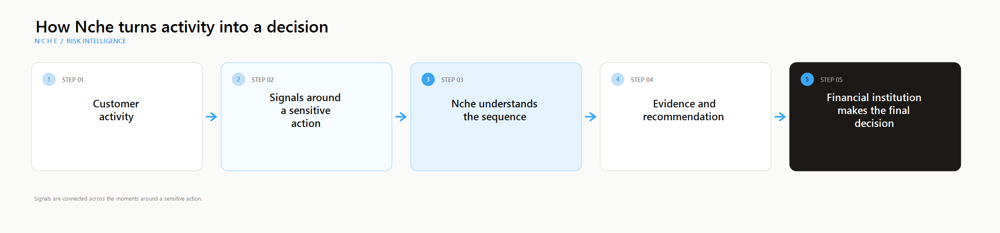

# Nche

> Nche helps financial institutions spot account takeover after login and before an unusual transfer becomes irreversible.

## The problem

Someone can have the correct password, the correct one-time code, and a successful login without being the real account owner.

After a fraudster gets access, the warning signs often appear in a short sequence:

1. A new device signs in.
2. The password or PIN is changed.
3. A new recipient is added.
4. A large transfer is attempted.

Each event can look ordinary on its own. Together, they can tell a very different story.

## What Nche does

Nche brings those signals together and gives the financial institution a clear recommendation:

- **Allow** the action when the activity looks normal.
- **Challenge** the customer when more verification is needed.
- **Review** the action when an analyst should decide.
- **Block** the action when the sequence looks highly dangerous.

The institution remains in control. Nche provides evidence and decision support; it does not move money or replace the institution's own authorization rules.

## Who it is for

Nche is being built for Nigerian banks, fintechs, wallets, microfinance institutions, payment service banks, mobile money operators, lenders, and cooperatives that need stronger fraud protection without building a large fraud engineering team from scratch.

## How the story works

Nche looks at the timing and relationship between events, the device being used, the recipient of the payment, and whether the amount is unusual for that customer. It explains why the recommendation was made so an analyst can understand and defend it.

## What you can try today

The repository includes three connected experiences:

- **Demo Financial App:** a customer starts a transfer and sees what happens when Nche evaluates it.
- **Nche Command:** an analyst signs in, views investigations, and reviews the evidence behind a decision.
- **New transfer analysis:** an analyst chooses an institution, builds a customer event sequence from scratch, and runs one complete analysis.

The demo can work with several institutions, including Apex MFB, Kuda, OPay, and PalmPay. You can add another institution in the workspace and use it for a new analysis.

## The important idea

Authentication proves that someone knows the secret. It does not always prove that the person controlling the account is the legitimate owner.

Nche helps institutions see what happens after authentication, while there is still time to ask for another check, send the case to an analyst, or stop the transfer.

## Current status

This repository contains a working product demo and the supporting risk service. It uses simulated events and simulated SIM intelligence, and it never submits a real payment.

The institution directory is currently kept in memory for the demo, so newly added institutions reset when the API restarts. Production deployments will need a permanent institution store, a production identity provider, and institution-specific policy configuration.

## Run the demo

Developers can find setup commands, routes, environment variables, and test commands in [docs/TECHNICAL.md](docs/TECHNICAL.md).

The guided presentation sequence is in [docs/DEMO-RUNBOOK.md](docs/DEMO-RUNBOOK.md). The system design is in [docs/ARCHITECTURE.md](docs/ARCHITECTURE.md).

## Project direction

Nche starts with account takeover and sensitive transfers. Over time, the same foundation can support recipient reputation, mule-account detection, authorized push payment fraud, payment-chain intelligence, and coordinated fraud detection across institutions.
