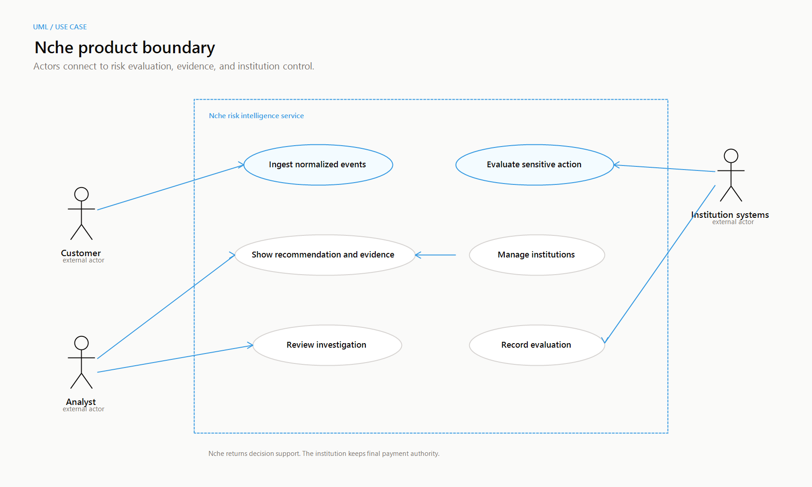
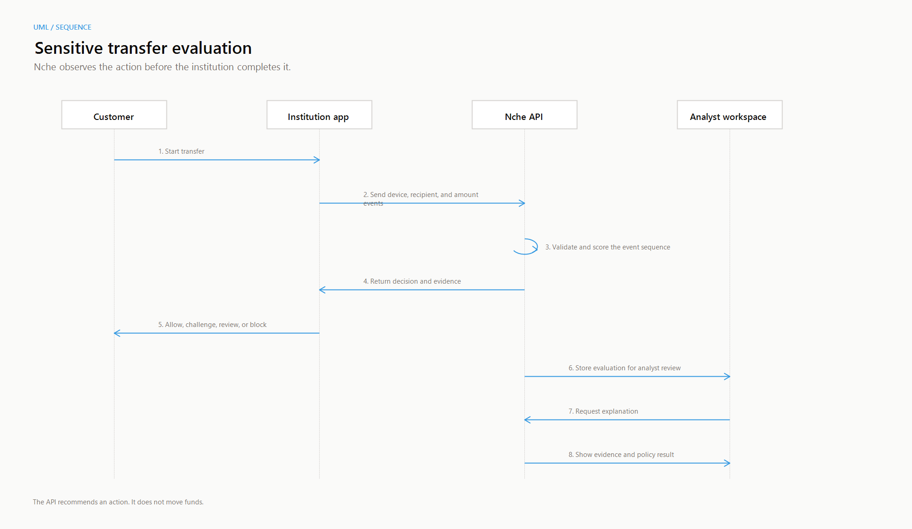

<section class="title-page">

<strong>PRODUCT DOCUMENTATION</strong>

<h1>NCHE</h1>
<h2>Explainable risk intelligence for sensitive financial actions</h2>

Product, use case, system behavior, and implementation overview

Version 0.3 - September 2026

For financial institutions, analysts, product teams, and technical reviewers

</section>

## 1. Product overview

Nche is a risk intelligence product for Nigerian banks, fintechs, wallets, microfinance institutions, payment service banks, lenders, and cooperatives. It helps an institution decide what to do when a customer starts a sensitive action, such as a large transfer.

Nche sits beside the institution's transaction flow. It receives normalized, pseudonymous events. It connects events that occur before the action. It returns a risk score, a recommendation, and evidence that explains the result. The institution keeps final authorization authority. Nche does not move money and does not replace the institution's payment controls.

### 1.1 The problem after login

A successful login does not always prove that the real customer controls the account. An attacker can use a correct password and a correct one-time code. The account takeover may become visible only after login. A new device, a password or PIN change, a new beneficiary, and an unusual transfer can form a dangerous sequence.

Manual review that starts after settlement is too late. A rule that blocks every unusual transfer creates friction for legitimate customers. Analysts need a clear reason for each action. Nche connects the sequence before the institution completes the payment.

Nche returns four recommendation states:

| Recommendation | Meaning |
| --- | --- |
| **Allow** | The available signals do not show enough risk to stop the action. |
| **Challenge** | Ask the customer for another verification step. |
| **Review** | Send the action to an analyst or an institution workflow. |
| **Block** | Stop the action while the institution investigates. |

### 1.2 Users and use cases

The customer uses the institution's financial application. The application sends Nche the events around a sensitive action. The institution system remains the system of record and applies the final authorization policy. The analyst uses Nche Command to sign in, select an institution workspace, review investigations, and read the evidence behind a recommendation.

The use-case diagram shows these roles and the Nche service boundary. It also shows that Nche provides decision support while the institution retains control.

The current demo includes Apex MFB, Kuda, OPay, and PalmPay. An analyst can add another institution while the API runs. This supports a multi-institution demonstration without a connection to a banking core.

## 2. Product workflow and implementation

### 2.1 Evaluation workflow

1. The institution creates normalized events with a customer reference, event name, channel, and time. Device, beneficiary, amount, and customer-median values are optional.
2. The institution sends the event sequence and institution reference to Nche.
3. The API validates the request and applies deterministic risk rules.
4. The engine combines event signals, timing, and amount deviation. It caps the score at 100 and classifies the result.
5. Nche returns the score, recommendation, policy rule, primary reason, evidence, model version, latency, and enforcement state.
6. The institution applies its own authorization policy. An analyst can open the evaluation and review the evidence.

The sequence diagram shows the exchange. Nche recommends an action. It does not execute a transfer.

### 2.2 Signals and decisions

The current rules assign 21 points to a new device login, 15 points to a password or PIN reset, 17 points to a new beneficiary, and 22 points to a transfer initiation. A sequence with three or more takeover signals receives a 15 point bonus.

When the transfer event includes a positive customer median amount, Nche adds a bounded amount anomaly score. The score increases as the transfer becomes larger than the customer's normal median. The transfer demo uses the same calculation for its live **Current risk** value. The API response includes the amount-to-median ratio in the evidence.

| Score | Level | Default recommendation |
| ---: | --- | --- |
| 0-29 | Low | Allow |
| 30-59 | Medium | Challenge |
| 60-79 | High | Review |
| 80-100 | Critical | Block |

### 2.3 Current software

The API uses FastAPI and Python. The web application uses Next.js and React. Shared TypeScript types describe the request and response contract. The API provides health checks, event ingestion, risk evaluation, sensitive-action evaluation, explanation retrieval, and institution management.

The action endpoint supports `Observe` and `Enforce` modes. Observe mode records a recommendation without applying it. Enforce mode marks it active for the institution workflow. An idempotency key makes a retry return the stored evaluation instead of creating a second decision.

The web application includes a public Demo Financial App, the protected Nche Command workspace, institution management, and a from-scratch transfer analysis page. A route-loading popup gives feedback during internal navigation. The demo uses a short upstream response window and falls back to local institution rules when Nche is unavailable.

## 3. User case, operating model, and references

### 3.1 Example user case

Assume that Seyi Okafor normally transfers about ₦35,326 at a time. A session starts from a new device. The password is reset. A new beneficiary is created. The session then attempts to transfer ₦650,000 to that beneficiary.

The customer has authenticated, but the sequence has changed. Nche receives the events in order. The device change, credential change, new beneficiary, and amount anomaly raise the score. The result reaches the critical range in the current demo. The institution can block the action, request another verification step, or send the case to an analyst.

The analyst can open the investigation and see the event order, the time between events, the transfer ratio, and the policy result. The analyst does not need to infer the reason from a number alone.

### 3.2 Institution control and data position

Nche supports institution-owned authority. Each evaluation includes an institution reference. Observe mode lets an institution compare recommendations with current rules. Enforce mode marks a recommendation as active for the action path.

The demo registry is process-local, so added institutions reset when the API restarts. Production use requires persistent institution records, an identity provider, signed sessions, multi-factor authentication, role-based access control, and audit records. The demo uses simulated events and never submits a real payment. A production integration should use pseudonymous references, data minimization, retention rules, access control, and audit logging.

### 3.3 Limits and next steps

The repository is a working product demonstration. It does not yet provide production identity management, persistent institution storage, policy authoring, real SIM intelligence, or full operational monitoring. Each institution must choose its fail-open or fail-closed policy for each action type.

Next steps include persistent policies, signed service requests, rate limits, audit logs, alerting, and evaluation against held-out fraud scenarios. Later versions can add recipient reputation, mule-account detection, authorized push payment signals, and shared intelligence. Each new signal needs a data owner, a privacy rule, and an explanation.

### 3.4 References

The [Central Bank of Nigeria Risk-Based Cybersecurity Framework](https://www.cbn.gov.ng/Out/2024/BSD/EXPOSURE%20DRAFT%20OF%20THE%20RISK-BASED%20CYBERSECURITY%20FRAMEWORK%20AND%20GUIDELINES%20FOR%20DEPOSIT%20MONEY%20BANKS%20AND%20PAYMENT%20SERVICE%20BANKS.pdf) describes risk-based cybersecurity controls for supervised Nigerian financial institutions. The [Nigerian Payments System Risk and Information Security Management Framework](https://www.cbn.gov.ng/out/2018/bpsd/nps_risk_and_info_sec_mgt_framework.pdf) provides payment-system risk context.

The [OWASP Authentication Cheat Sheet](https://cheatsheetseries.owasp.org/cheatsheets/Authentication_Cheat_Sheet.html) covers re-authentication after risk events and controls for sensitive actions. The [OWASP Multifactor Authentication Cheat Sheet](https://cheatsheetseries.owasp.org/cheatsheets/Multifactor_Authentication_Cheat_Sheet.html) covers independent factors and SIM-swap signals.

These references support the product context. They do not certify Nche or replace an institution's legal, regulatory, security, or risk review.

**Definitions:** An **account takeover** is unauthorized control of an existing customer account. A **sensitive action** can create material customer or institution harm. An **event sequence** is the ordered set of events that Nche evaluates. **Evidence** is the event detail and calculation that explains a recommendation.

<strong>Scope note:</strong> This document describes the current Nche repository and demo behavior. It is not a security certification, a regulatory opinion, or a production deployment guide.

